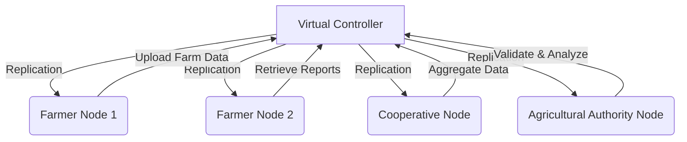

# MyCloud – Distributed Agricultural Data and Resource Management System  

> **🚀 Quick Start**: See [STARTUP_INSTRUCTIONS.md](STARTUP_INSTRUCTIONS.md) to initialize the distributed storage nodes!  
> **📊 Current Status**: Check [CURRENT_STATUS.md](CURRENT_STATUS.md) for platform health and operational progress.

---

## 🎯 Quick Links

- **[🚀 Startup Instructions](STARTUP_INSTRUCTIONS.md)** – Resolve distributed node availability issues  
- **[📊 Current Status](CURRENT_STATUS.md)** – Monitor system health and active services  
- **[✅ Integration Complete](INTEGRATION_COMPLETE.md)** – Architecture and integration overview  
- **[🔧 Test System](../test-system.ps1)** – Execute system diagnostics  
- **[⚡ Start Nodes](start-nodes.ps1)** – Automatically launch agricultural data nodes  
---

## 📑 Table of Contents  

1. [Introduction](#1-introduction)  
2. [Problem Description](#2-problem-description)  
   - [Agricultural Challenges in Africa](#21-agricultural-challenges-in-africa)  
   - [Pain Points Faced by Farmers](#22-pain-points-faced-by-farmers)  
   - [Socio-Economic Impact](#23-socio-economic-impact)  
3. [Problem Scope](#3-problem-scope)  
4. [Solution Proposal](#4-solution-proposal)  
5. [System Design](#5-system-design)  
   - [High-Level Architecture](#51-high-level-architecture)  
   - [Architecture Diagram](#52-architecture-diagram)  
   - [Distributed Features](#53-distributed-features)  
6. [Role of Distributed Systems](#6-role-of-distributed-systems)  
7. [Contribution of Cloud Computing](#7-contribution-of-cloud-computing)  
8. [CAP Theorem in MyCloud](#8-cap-theorem-in-mycloud)  
9. [Proposed Technologies](#9-proposed-technologies)  
10. [Project Timeline](#10-project-timeline)  
11. [Expected Outcomes](#11-expected-outcomes)  
12. [Conclusion](#12-conclusion)  

---

## 1. Introduction  

Agriculture remains the backbone of many African economies, yet it faces persistent challenges related to data fragmentation, limited access to information, and poor coordination between stakeholders. Small-scale farmers, cooperatives, and agricultural institutions often operate in isolation, relying on manual record-keeping and informal communication channels.  

- **Farm data** is scattered and poorly preserved.  
- **Market and weather information** is often delayed or unreliable.  
- **Farmers** lack digital tools for collaboration and decision-making.  

**MyCloud** is a distributed, cloud-based platform designed to address these challenges. Rather than acting as a simple data repository, MyCloud emphasizes **data sharing, collaboration, resilience, and scalability** across the agricultural ecosystem. The system enables stakeholders to:  

- Store and access farm records (yields, inputs, soil data).  
- Share market prices, weather reports, and best practices.  
- Collaborate across farms, cooperatives, and agricultural offices.  

From a technical perspective, MyCloud is implemented as a **distributed systems simulation** managed by a **Virtual Controller** coordinating multiple **Nodes** (farmers, cooperatives, research centers, and agricultural authorities). Agricultural data is **replicated across nodes** to ensure **availability and fault tolerance**, while **cloud computing principles** enable elastic scaling as participation grows.  

---

## 2. Problem Description  

### 2.1 Agricultural Challenges in Africa  

Despite employing a large portion of the population, African agriculture remains largely under-digitized. Productivity growth is slow due to limited access to reliable information and infrastructure.  

- **Cameroon:** Smallholder farmers rely heavily on manual records and informal advice.  
- **Nigeria:** Market price volatility causes losses due to lack of real-time data.  
- **Kenya:** Weather variability impacts yields, yet forecasting access is limited.  
- **Ghana:** Weak coordination between farmers and extension services reduces efficiency.  

### 2.2 Pain Points Faced by Farmers  

1. **Data Fragmentation**  
   Farm records are kept on paper or isolated devices, making analysis and sharing difficult.  

2. **Limited Market Access**  
   Farmers struggle to access up-to-date pricing and demand information.  

3. **Lack of Collaboration**  
   There are few structured platforms for farmers to share experiences, inputs, or resources.  

4. **Unreliable Infrastructure**  
   Power outages and unstable connectivity disrupt access to agricultural data systems.  

5. **Information Asymmetry and Exploitation**  
   Middlemen exploit farmers due to lack of transparent information. 

### 2.3 Socio-Economic Impact  

- **Low productivity:** Inefficient farming practices persist.  
- **Income instability:** Farmers receive unfair prices for produce.  
- **Food insecurity:** Poor coordination affects supply chains and availability.  

---

## 3. Problem Scope  

MyCloud focuses on **agricultural data management and collaboration**, targeting:  

- Small and medium-scale farmers.  
- Agricultural cooperatives and associations.  
- Extension services and research institutions.  
- Distributed data storage for resilience and growth.  

**Limitations:**  
- MyCloud does not replace national agricultural policy.  
- Initial deployment focuses on **regional farming communities**.  
- The system begins as a **simulation platform** with future production potential.  

---

## 4. Solution Proposal  

MyCloud delivers a **scalable, resilient, and collaborative agricultural platform**.  

**Core Features:**  
- **Agricultural Data Hub:** Centralized access to farm records and analytics.  
- **Knowledge Sharing:** Exchange of farming techniques, weather data, and advisories.  
- **Collaboration Tools:** Shared documents, reports, and cooperative planning.  
- **Distributed Architecture:** Controller-node model with replicated storage.  
- **Cloud Deployment:** Elastic resource allocation during peak farming seasons.  

---

## 5. System Design  

System diagrams will be added in later stages; placeholders are included.  
MyCloud is architected as a distributed system with a central **Virtual Controller** coordinating multiple **Agricultural Nodes**. The design prioritizes **scalability, fault tolerance, and cooperative data sharing**, aligning with distributed systems and cloud computing principles.  

### 5.1 High-Level Architecture  

The system is structured into three layers:  

1. **Controller Layer**  
   - Coordinates node registration and communication.  
   - Manages replication, synchronization, and consistency.  
   - Logs agricultural events (data uploads, updates, alerts).  

2. **Node Layer**  
   - Represents participants:  
     - **Farmer Nodes** → upload crop data, yields, and input usage.  
     - **Cooperative Nodes** → aggregate data and manage shared resources.  
     - **Agricultural Authority Nodes** → validate and analyze data.  
   - Each node maintains local storage and syncs with the controller.  

3. **API & Collaboration Layer**  
   - Supports dashboards, alerts, and shared workflows.  
   - Exposes REST/gRPC APIs for web and mobile access.  

---

### 5.2 Architecture Diagram  

### 5.3 Distributed Features  

- **Segmentation:** Large agricultural datasets (farm maps, crop images, soil reports) split into chunks before replication.  
- **Threading:** Multiple uploads/downloads of data processed concurrently.  
- **Fault Tolerance:** Farm and supply chain data remains accessible despite node failures.  
- **Scalability:** New nodes (farms, cooperatives, or agricultural offices) join seamlessly.  

---
## 6. How Distributed Systems Help  

Distributed systems are at the core of **MyCloud for Agriculture**, ensuring that the platform is not only functional but also resilient, scalable, and collaborative. Instead of relying on a single server, the system distributes workload and data across multiple nodes, which makes it more tolerant to failures and better suited for Africa’s rural and infrastructural challenges.

### 6.1 Replication for Reliability

Replication ensures that critical agricultural data—such as crop inventories, market prices, and farm reports—is always available, even if some nodes fail.

**Fault Tolerance:** When a node storing farm data goes offline, other replicas can still serve the information.

**Load Sharing:** Queries (like “find maize prices in Douala”) can be distributed among nodes to prevent overload.

**Practical Example:** If Node A (Farm Cooperative Server in Yaoundé) fails, Node B (Regional Agricultural Office in Douala) still has the same crop and farm management data.

### 6.2 Partition Tolerance for Unreliable Networks

Rural African regions often face power cuts, poor internet, or weak mobile data. Partition tolerance ensures MyCloud continues to serve requests even when nodes cannot communicate.

Farmers using offline nodes can still access cached data (crop schedules, soil tests).

Updates are synchronized later when the connection is restored.

This prevents downtime during critical periods like planting or harvest seasons.

### 6.3 Scalability for Growing Demand

MyCloud is designed to grow with agricultural networks.

**Horizontal Scaling:** New farm nodes or cooperative offices can be added without major redesign.

**Elastic Scaling:** Cloud resources expand or contract based on demand (e.g., harvest peak periods).

**Database Sharding:** Data can be divided by region or crop type to improve performance.

**Example:** A regional network may start with 500 farms. If it grows to 5,000 farms across multiple regions, MyCloud can provision new nodes and balance traffic automatically.

### 6.4 Collaboration via Distributed Workflows

Collaboration is central to MyCloud Agriculture:

**Shared Workspace:** Farmers and agricultural officers upload and view crop reports, pest alerts, and market receipts in real-time.

**Notifications:** Events like “new harvest data uploaded” or “market price updated” are propagated across all nodes using pub-sub patterns.

**Community Monitoring:** Farmers can collectively flag crop diseases or market scams, with alerts distributed system-wide.

### 6.5 Performance Optimization

**Load Balancing:** Queries are routed to the least busy replica.

**Caching:** Popular data (like “current maize prices in Adamawa”) are cached for fast retrieval.

**Parallelism:** Multiple dataset uploads/downloads happen simultaneously.

Even if thousands of farmers access the system at once, MyCloud remains responsive.

### 6.6 Security and Trust in Distributed Systems

Distributed systems protect sensitive agricultural and financial data.

**Redundant Encrypted Storage:** Even if one node is compromised, farm data remains safe.

**Verification Nodes:** Agricultural offices act as trusted validators of farm data and market prices.

**Distributed Logs:** Every transaction, crop update, and market report is logged across multiple nodes, making tampering nearly impossible.

### 6.7 Real-World Analogies

**Google Docs:** Real-time collaboration → mirrors MyCloud’s farm data sharing.

**WhatsApp Groups:** Messages replicated globally → similar to MyCloud’s farmer notifications.

### 6.8 Summary

Distributed systems make MyCloud Agriculture:

- Reliable through replication.  
- Resilient through partition tolerance.  
- Scalable through elastic growth.  
- Collaborative through shared resources and workflows.  

Without distributed systems, MyCloud would fail under Africa’s infrastructural constraints. With them, it becomes a **fault-tolerant, scalable, and community-driven platform for improving agricultural productivity and market access.**

---

## 7. How Cloud Computing Helps  

Cloud computing provides MyCloud Agriculture with the infrastructure, elasticity, and flexibility needed to deliver services effectively in African rural and semi-urban areas. It ensures farmers, cooperatives, and agricultural offices access the system anywhere, anytime, without depending on a single physical server.

### 7.1 Elasticity and Resource Scaling

Cloud elasticity allows scaling resources depending on seasonal agricultural demand.

**Harvest Peaks:** During peak harvests, when thousands of farmers upload data, MyCloud can automatically allocate more compute and storage resources.

**Off-Season:** During off-season periods, resources can be released to reduce operational costs.

**Practical Example:** A farm management tool that serves 500 farmers today can scale instantly to serve 5,000 farmers tomorrow.

### 7.2 Deployment Models for MyCloud Agriculture

**Private Cloud:**  

- A single cooperative deploys MyCloud for its farmers.  
- Sensitive farm data (production volumes, financial info) stays on local servers.  
- Best for regions with strong IT support.  

**Public Cloud:**  

- Multiple cooperatives across regions share a single MyCloud instance.  
- Cheaper and more accessible for smallholders.  
- Encourages regional collaboration.  

**Hybrid Cloud:**  

- Combines private and public cloud.  
- Example: Sensitive financial data remains on local servers, but general market and weather data is hosted on the public cloud.  

### 7.3 Cloud Service Models Applied

**IaaS (Infrastructure as a Service):**  

- Virtual machines and storage host MyCloud nodes.  
- Reduces the need for cooperatives to buy physical servers.  

**PaaS (Platform as a Service):**  

- Frameworks run APIs for crop tracking, weather analytics, and market prices.  
- Speeds up development and maintenance.  

**SaaS (Software as a Service):**  

- Delivered as web and mobile apps for farmers, cooperatives, and agricultural officers.  
- Users access farm data and collaborate without complex software installation.  

### 7.4 Collaboration Through Cloud Platforms

Cloud computing enables:

- **Shared Workspaces:** Farmers manage crop schedules, pest control logs, and payments collaboratively.  
- **Real-Time Synchronization:** Updates to crop data and market prices are instantly visible.  
- **File Sharing and Storage:** Soil reports, certificates, and harvest images uploaded once and securely accessed by multiple parties.  
- **Notifications:** Cloud-based alerts inform farmers of market changes or pest outbreaks immediately.  

### 7.5 Fault Tolerance and High Availability in the Cloud

Cloud infrastructure ensures resilience:

- **Multi-Zone Deployment:** If a server in Douala fails, another in Yaoundé automatically takes over.  
- **Redundant Storage:** Farm and market data stored in multiple locations.  
- **Disaster Recovery:** Backups prevent data loss during outages, critical for African farming areas.  

### 7.6 Security Benefits of Cloud Computing

- **Data Encryption:** All farm and financial data encrypted during transmission and at rest.  
- **Identity Management:** Farmers and cooperatives verified via cloud services.  
- **Access Control:** Only verified users can view or upload data.  
- **Audit Logs:** All updates, transactions, and alerts logged across nodes.  

### 7.7 Cost Efficiency and Accessibility

- Pay-as-you-go pricing reduces costs for smallholder farmers and cooperatives.  
- Lightweight mobile access allows use on low-end devices.  

### 7.8 Real-World Inspiration

- **Google Drive:** File replication and collaboration mirrors MyCloud’s shared farm data.  
- **Zoom/Teams:** Demonstrates cloud support for distributed real-time collaboration among farmers and cooperatives.  

### 7.9 Summary

Cloud computing empowers MyCloud Agriculture to:

- Scale elastically during peak agricultural periods.  
- Remain resilient through redundancy.  
- Enable seamless collaboration across regions.  
- Provide strong security and cost efficiency.  

Together with distributed systems, cloud computing ensures MyCloud Agriculture is a **practical, scalable, and collaborative platform** transforming African agriculture.

---
## 8. CAP Theorem in MyCloud Agriculture  

The CAP theorem is a fundamental principle in distributed systems. It states that in the presence of a network partition, a distributed system can guarantee only two out of three: Consistency, Availability, and Partition Tolerance.

MyCloud Agriculture is designed for Africa’s rural and semi-urban farming regions, where network reliability may be limited. Therefore, the system prioritizes **Availability and Partition Tolerance (AP)** over strict Consistency.

### 8.1 Consistency

**Definition:** All nodes should see the same data at the same time.  

**MyCloud Approach:** MyCloud Agriculture uses eventual consistency. For example, if a farmer uploads harvest data in Adamawa, it may take a short delay before appearing on nodes in Douala or Yaoundé.  

**Reason:** Slight delays are acceptable because farmers prioritize system availability for market decisions and field operations.

### 8.2 Availability

**Definition:** Every request should always receive a valid response.  

**MyCloud Approach:** Even during partial failures, farmers can:

- View cached crop schedules and market prices.  
- Access cooperative reports.  
- Upload local data (synchronized later).  

**Example:** If a replication node goes offline during planting season, farmers still get responses from remaining active nodes.

### 8.3 Partition Tolerance

**Definition:** The system continues to operate despite communication breakdowns between nodes.  

**MyCloud Approach:** Nodes work offline and synchronize automatically when connectivity returns.  

**Example:** During internet outages in rural farms, farmers can continue recording crop activities or uploading soil tests, with synchronization occurring later.

### 8.4 Trade-Off Justification

MyCloud Agriculture chooses **AP (Availability + Partition Tolerance):**

- **Why not CA?** Strict consistency with availability is impractical under frequent African rural network outages.  
- **Why not CP?** Sacrificing availability would frustrate farmers needing timely market or agricultural data.  
- **Why AP?** Ensures resilience, allowing critical agricultural operations to continue uninterrupted.

---

## 9. Proposed Technologies  

MyCloud Agriculture integrates modern technologies to support real-world agricultural operations, while remaining deployable in African rural contexts.

### 9.1 Backend

- **Language & Framework:** Java (Spring Boot) for robust, service-oriented development.  
- **Communication:** gRPC for high-performance RPCs between farm nodes and central controllers.  
- **Database:** PostgreSQL for relational data (farm records, crop inventories, market prices, cooperative reports).  

### 9.2 Frontend

- **React.js Dashboard:** User-friendly interface for farmers, cooperatives, and agricultural officers.  
- **Mobile-Friendly:** Lightweight and responsive design suitable for low-bandwidth rural environments.  

### 9.3 Storage

- **Local File System (Simulation):** For testing farm data uploads and replication.  
- **Cloud Storage (Extension):** AWS S3 or Azure Blob for large-scale deployments with redundancy.  

### 9.4 Deployment & Infrastructure

- **Docker:** Ensures portability across local and cloud servers.  
- **Kubernetes:** Future scaling and orchestration.  
- **CI/CD Pipelines:** GitHub Actions for automated testing and deployment.

### 9.5 Security Tools

- **JWT Authentication:** Secure communication between nodes.  
- **SSL/TLS Encryption:** Protects farm and financial data.  
- **Identity Verification:** Agricultural offices or cooperatives act as trusted validators.

---

## 10. Calendar of Activities  

| Week | Task | Deliverable |  
|------|------|-------------|  
| 1 | Requirements gathering | Agricultural requirements specification document |  
| 2 | Architecture design | System diagrams for farm nodes and cloud deployment |  
| 3–4 | Node registration + farm data sharing | Prototype of distributed farm network |  
| 5 | Replication & fault tolerance | Resilient farm data storage |  
| 6 | Crop tracking & market integration | Crop and market data API |  
| 7 | Collaboration tools | Shared farm workspace and notifications |  
| 8 | API/dashboard integration | REST/gRPC endpoints |  
| 9 | Testing & debugging | Test report for farm data operations |  
| 10 | Deployment + documentation | GitHub repo + final report |  

---

## 11. Expected Results  

- **Efficient farm management:** Farmers can track crops, harvest schedules, and storage in real time.  
- **Reliable access to market data:** Prices, demand trends, and cooperative updates available even during network outages.  
- **Fault-tolerant, distributed agricultural storage:** Ensures critical farm data remains accessible.  
- **Scalable platform covering multiple regions:** Supports smallholders to large cooperatives.  
- **Digital collaboration:** Farmers, cooperatives, and officers can share crop reports, soil tests, and market analytics.  

---

## 12. Conclusion  

MyCloud Agriculture addresses the **real-world African problem of inefficient farm management, delayed market access, and lack of collaborative tools for smallholder farmers**.  

By applying **distributed systems concepts** (replication, fault tolerance, scalability) and **cloud computing** (elasticity, hybrid deployment, SaaS models), MyCloud Agriculture provides a **resilient, scalable, and collaborative platform**.  

It demonstrates how technology can **increase agricultural productivity, improve farmer incomes, and strengthen food security**—an African agricultural problem effectively solved through distributed systems and cloud computing.

---
