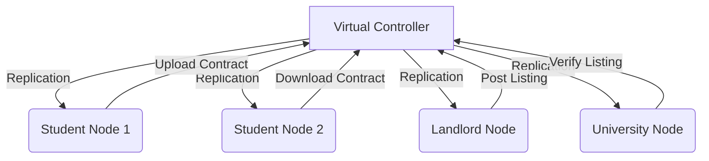

# MyCloud – Distributed Agricultural Data and Resource Management System  

> **🚀 Quick Start**: See [STARTUP_INSTRUCTIONS.md](STARTUP_INSTRUCTIONS.md) to initialize the distributed storage nodes!  
> **📊 Current Status**: Check [CURRENT_STATUS.md](CURRENT_STATUS.md) for platform health and operational progress.

---

## 🎯 Quick Links

- **[🚀 Startup Instructions](STARTUP_INSTRUCTIONS.md)** – Resolve distributed node availability issues  
- **[📊 Current Status](CURRENT_STATUS.md)** – Monitor system health and active services  
- **[✅ Integration Complete](INTEGRATION_COMPLETE.md)** – Architecture and integration overview  
- **[🔧 Test System](../test-system.ps1)** – Execute system diagnostics  
- **[⚡ Start Nodes](start-nodes.ps1)** – Automatically launch agricultural data nodes  
---

## 📑 Table of Contents  

1. [Introduction](#1-introduction)  
2. [Problem Description](#2-problem-description)  
   - [Agricultural Challenges in Africa](#21-agricultural-challenges-in-africa)  
   - [Pain Points Faced by Farmers](#22-pain-points-faced-by-farmers)  
   - [Socio-Economic Impact](#23-socio-economic-impact)  
3. [Problem Scope](#3-problem-scope)  
4. [Solution Proposal](#4-solution-proposal)  
5. [System Design](#5-system-design)  
   - [High-Level Architecture](#51-high-level-architecture)  
   - [Architecture Diagram](#52-architecture-diagram)  
   - [Distributed Features](#53-distributed-features)  
6. [Role of Distributed Systems](#6-role-of-distributed-systems)  
7. [Contribution of Cloud Computing](#7-contribution-of-cloud-computing)  
8. [CAP Theorem in MyCloud](#8-cap-theorem-in-mycloud)  
9. [Proposed Technologies](#9-proposed-technologies)  
10. [Project Timeline](#10-project-timeline)  
11. [Expected Outcomes](#11-expected-outcomes)  
12. [Conclusion](#12-conclusion)  

---

## 1. Introduction  

Agriculture remains the backbone of many African economies, yet it faces persistent challenges related to data fragmentation, limited access to information, and poor coordination between stakeholders. Small-scale farmers, cooperatives, and agricultural institutions often operate in isolation, relying on manual record-keeping and informal communication channels.  

- **Farm data** is scattered and poorly preserved.  
- **Market and weather information** is often delayed or unreliable.  
- **Farmers** lack digital tools for collaboration and decision-making.  

**MyCloud** is a distributed, cloud-based platform designed to address these challenges. Rather than acting as a simple data repository, MyCloud emphasizes **data sharing, collaboration, resilience, and scalability** across the agricultural ecosystem. The system enables stakeholders to:  

- Store and access farm records (yields, inputs, soil data).  
- Share market prices, weather reports, and best practices.  
- Collaborate across farms, cooperatives, and agricultural offices.  

From a technical perspective, MyCloud is implemented as a **distributed systems simulation** managed by a **Virtual Controller** coordinating multiple **Nodes** (farmers, cooperatives, research centers, and agricultural authorities). Agricultural data is **replicated across nodes** to ensure **availability and fault tolerance**, while **cloud computing principles** enable elastic scaling as participation grows.  

---

## 2. Problem Description  

### 2.1 Agricultural Challenges in Africa  

Despite employing a large portion of the population, African agriculture remains largely under-digitized. Productivity growth is slow due to limited access to reliable information and infrastructure.  

- **Cameroon:** Smallholder farmers rely heavily on manual records and informal advice.  
- **Nigeria:** Market price volatility causes losses due to lack of real-time data.  
- **Kenya:** Weather variability impacts yields, yet forecasting access is limited.  
- **Ghana:** Weak coordination between farmers and extension services reduces efficiency.  

### 2.2 Pain Points Faced by Farmers  

1. **Data Fragmentation**  
   Farm records are kept on paper or isolated devices, making analysis and sharing difficult.  

2. **Limited Market Access**  
   Farmers struggle to access up-to-date pricing and demand information.  

3. **Lack of Collaboration**  
   There are few structured platforms for farmers to share experiences, inputs, or resources.  

4. **Unreliable Infrastructure**  
   Power outages and unstable connectivity disrupt access to agricultural data systems.  

5. **Information Asymmetry and Exploitation**  
   Middlemen exploit farmers due to lack of transparent information. 

### 2.3 Socio-Economic Impact  

- **Low productivity:** Inefficient farming practices persist.  
- **Income instability:** Farmers receive unfair prices for produce.  
- **Food insecurity:** Poor coordination affects supply chains and availability.  

---

## 3. Problem Scope  

MyCloud focuses on **agricultural data management and collaboration**, targeting:  

- Small and medium-scale farmers.  
- Agricultural cooperatives and associations.  
- Extension services and research institutions.  
- Distributed data storage for resilience and growth.  

**Limitations:**  
- MyCloud does not replace national agricultural policy.  
- Initial deployment focuses on **regional farming communities**.  
- The system begins as a **simulation platform** with future production potential.  

---

## 4. Solution Proposal  

MyCloud provides a **scalable, fault-tolerant, and collaborative housing platform**.  

**Key Features:**  
- **Marketplace:** Central hub for listings.  
- **Roommate Matching:** Profiles (budget, lifestyle, location, habits) used to suggest compatible roommates.  
- **Collaboration Tools:** Groups share rental contracts, bills, and documents.  
- **Distributed Architecture:** Controller + nodes with replication.  
- **Cloud Deployment:** Elastic scaling to handle peak semester demand.  

---

## 5. System Design
 System Diagrams will be provided later, placeholders inserted as replacement
The architecture of MyCloud is intentionally modeled as a distributed system with a central **Virtual Controller** and multiple **Nodes** representing students, landlords, and university housing offices. The design prioritizes **scalability, fault tolerance, and collaboration**, which are essental requirements of distributed systems and cloud computing.  

### 5.1 High-Level Architecture  

The architecture can be visualized in three main layers:  

1. **Controller Layer (Virtual Controller)**  
   - Acts as the central coordinator.  
   - Manages node registration, communication, replication, and consistency.  
   - Logs activities (e.g., node connected, file uploaded, roommate matched).  

2. **Node Layer**  
   - Represents individual entities:  
     - **Student Nodes** → search housing, create roommate profiles, upload contracts.  
     - **Landlord Nodes** → upload listings, documents, rental details.  
     - **University Housing Nodes** → act as trusted verification bodies.  
   - Each node maintains local state and communicates with the controller.  

3. **Collaboration & API Layer**  
   - Handles file sharing, roommate group collaboration, notifications.  
   - Provides REST/gRPC APIs for integration with web dashboards or mobile apps.  

---

### 5.2  Architecture Diagram  

### 5.3 Distributed Features  

- **Segmentation:** Large files (contracts, IDs) split into chunks before replication.  
- **Threading:** Multiple uploads/downloads processed concurrently.  
- **Fault Tolerance:** Data remains accessible despite node failures.  
- **Scalability:** New nodes (universities/campuses) join seamlessly.  

---

## 6. How Distributed Systems Help  

Distributed systems are at the core of MyCloud, ensuring that the platform is not only functional but also resilient, scalable, and collaborative. Instead of relying on a single server, the system distributes workload and data across multiple nodes, which makes it more tolerant to failures and better suited for Africa’s infrastructural challenges.

### 6.1 Replication for Reliability

Replication ensures that critical housing and roommate data is always available, even if some nodes fail.

**Fault Tolerance**: When a node storing listings goes offline, other replicas can still serve the data.

**Load Sharing**: Queries (like “find me a room under $50”) can be distributed among nodes to prevent overload.

Practical Example: If Node A (University Server in Yaoundé) fails, Node B (University Server in Douala) still has the same listings and roommate profiles.

### 6.2 Partition Tolerance for Unreliable Networks

African regions often face power cuts, poor internet, or weak mobile data. Partition tolerance ensures MyCloud continues to serve requests even when nodes cannot talk to each other.

Users on disconnected nodes can still read cached data (listings, roommate profiles).

Updates are synchronized later when the connection is restored.

This avoids frustrating downtime for students relying on time-sensitive housing searches.

### 6.3 Scalability for Growing Demand

MyCloud is designed to grow with universities.

**Horizontal Scaling**: New student or landlord nodes can be added without major redesign.

**Elastic Scaling**: Cloud resources expand or contract based on demand (e.g., during semester starts).

**Database Sharding**: Data can be divided by city or university to improve performance.

For example, ICT University may start with 5,000 users. If demand grows to 50,000 across several universities, MyCloud can simply provision new nodes and balance traffic automatically.

### 6.4 Collaboration via Distributed Workflows

Collaboration is central to the system and is enabled by distributed features:

**Shared Workspace**: Roommates upload and view contracts, receipts, and bills in real-time.

**Notifications**: Events like “new roommate found” or “landlord approved” are propagated across all nodes. W can use the pub-sub pattern to achieve this

**Community Monitoring**: Students can collectively flag scams, and these warnings are distributed system-wide.

### 6.5 Performance Optimization

**Load Balancing**: Queries are routed to the least busy replica.

**Caching**: Popular listings (like “2-bedroom apartments near ICT campus”) are cached for fast retrieval.

**Parallelism**: Multiple file uploads/downloads happen simultaneously.

This means that even if thousands of students search at once, MyCloud remains responsive.

### 6.6 Security and Trust in Distributed Systems

Distributed systems help combat fraudulent landlords and unsafe listings.

**Redundant Encrypted Storag**e: Even if one node is hacked, data remains safe.

**University Verification Nodes**: Universities act as trusted validators of listings.

**Distributed Logs**: Every listing and roommate match is logged across multiple nodes, making tampering nearly impossible.

### 6.7 Real-World Analogies

**Google Docs**: Real-time editing → mirrors MyCloud’s roommate collaboration.

**WhatsApp Groups**: Messages replicated globally → similar to MyCloud’s notifications.

### 6.8 Summary

Distributed systems make MyCloud:

Reliable through replication.

Resilient through partition tolerance.

Scalable through elastic growth.

Collaborative through shared resources and workflows.

Without distributed systems, MyCloud would collapse under Africa’s infrastructural challenges. With them, it becomes a fault-tolerant, scalable, and community-driven platform for solving the real problem of student housing.

---

## 7. How Cloud Computing Helps  

While distributed systems provide the foundation of resilience and scalability, cloud computing gives MyCloud the infrastructure, elasticity, and flexibility needed to deliver services effectively in the African context. By leveraging cloud technologies, MyCloud can ensure that students and landlords access the system anywhere, anytime, without depending on a single physical server.

### 7.1 Elasticity and Resource Scaling

One of the major strengths of cloud computing is elasticity, the ability to scale resources up or down depending on demand.

**Semester Peaks**: At the beginning of a semester, when thousands of students are searching for accommodation, MyCloud can automatically allocate more compute and storage resources.

**Low Demand Periods**: During breaks or holidays, unnecessary resources can be released, reducing operational costs.

**Practical Example**: A housing search engine that can serve 500 students today can scale instantly to serve 5,000 students tomorrow without downtime.

### 7.2 Deployment Models for MyCloud

Different cloud deployment models make the system adaptable to various institutions:

**Private Cloud:**

A single university deploys MyCloud for its students only.

Sensitive student data (IDs, contracts) stays on campus servers.

Best for universities with strong IT departments.

**Public Cloud**:

Multiple universities across different regions share a single MyCloud instance.

Cheaper and more accessible to smaller institutions.

Encourages collaboration between universities.

**Hybrid Cloud**:

Combines private and public cloud.

Example: University keeps sensitive student data in its private servers, but uses public cloud to store general listings.

### 7.3 Cloud Service Models Applied

MyCloud incorporates all three major cloud service models:

**IaaS (Infrastructure as a Service):**

Virtual machines and storage provided by AWS, Azure, or GCP host the controller and nodes.

Reduces the need for universities to purchase physical servers.

**PaaS (Platform as a Service):**

Frameworks for running APIs, roommate matching services, and housing analytics.

Speeds up development and reduces maintenance overhead.

**SaaS (Software as a Service):**

MyCloud is delivered to end users (students, landlords, housing offices) as a web or mobile app.

Students access listings and collaborate without needing to install complex software.

### 7.4 Collaboration Through Cloud Platforms

Cloud computing makes collaboration more powerful:

**Shared Workspaces**: Students in different towns can jointly manage rent payments, contracts, or bills.

**Real-Time Synchronization:** Updates to housing listings are reflected instantly across all devices.

**File Sharing and Storage**: Documents (IDs, contracts, receipts) are uploaded once and securely accessed by multiple parties.

**Notifications**: Cloud-based messaging ensures students are alerted to new housing opportunities immediately.

### 7.5 Fault Tolerance and High Availability in the Cloud

Cloud infrastructure ensures that MyCloud is resilient to failures.

**Multi-Zone Deployment**: If a server in Nairobi goes down, another in Lagos automatically takes over.

**Redundant Storage**: Files are stored in multiple locations (e.g., AWS S3 replication across regions).

**Disaster Recovery**: Backups in cloud storage mean student data is safe even after catastrophic failures.

This is particularly vital in Africa, where power and internet outages are frequent.

### 7.6 Security Benefits of Cloud Computing

Security is critical when handling sensitive student data. Cloud computing strengthens MyCloud in several ways:

**Data Encryption**: All housing data is encrypted during transmission and at rest.

**Identity Management**: Cloud services like AWS Cognito or Firebase Authentication verify students and landlords.

**Access Control:** Only verified users can view or upload listings.

**Audit Logs:** All actions (uploads, roommate matches, landlord approvals) are recorded in distributed logs.

### 7.7 Cost Efficiency and Accessibility

Cloud computing allows pay-as-you-go pricing, which fits the African educational context where budgets are limited.

Universities don’t need to buy costly hardware.

Small institutions can subscribe only for what they use.

MyCloud remains accessible even on low-end mobile devices through lightweight cloud-based APIs.

### 7.8 Real-World Inspiration

**Google Drive**: Demonstrates file replication and collaboration, similar to MyCloud’s roommate workspaces.

**Zoom/Teams**: Show how cloud platforms support distributed collaboration in real-time.

### 7.9 Summary

Cloud computing empowers MyCloud to:

Scale elastically during housing demand surges.

Remain resilient to failures through redundancy.

Enable seamless collaboration across regions.

Provide strong security and cost efficiency.

Together with distributed systems, cloud computing ensures that MyCloud is not only a simulation project but also a real-world-ready platform capable of transforming student housing in Africa.

---

## 8. CAP Theorem in MyCloud  

The CAP theorem is a fundamental principle in distributed systems. It states that in the presence of a network partition, a distributed system can only guarantee two out of three: Consistency, Availability, and Partition Tolerance.

MyCloud is designed with Africa’s unreliable infrastructure in mind, and therefore prioritizes Availability and Partition Tolerance (AP) over strict Consistency.

### 8.1 Consistency

Definition: All nodes should see the same data at the same time.

MyCloud Approach: MyCloud uses eventual consistency. For example, if a landlord uploads a listing in Yaoundé, it may take a short delay before it appears on nodes in Douala or Nairobi.

Reason: This delay is acceptable because students care more about system availability than instant synchronization.

### 8.2 Availability

Definition: Every request should always receive a valid response.

MyCloud Approach: Even during partial system failures, MyCloud ensures that students can still:

View cached listings.

Access roommate profiles.

Perform local file uploads (synced later).

Example: If a replication node goes offline, students still get responses from remaining active nodes.

### 8.3 Partition Tolerance

Definition: The system continues to function despite communication breakdowns between nodes.

MyCloud Approach: Nodes are designed to work offline and synchronize later.

Example: If internet outages occur in one campus, students can still use cached data and upload files. Once connectivity is restored, the system synchronizes data with other campuses.

### 8.4 Trade-Off Justification

MyCloud chooses AP (Availability + Partition Tolerance):

Why not CA? Strict consistency with availability is impossible under frequent African outages.

Why not CP? Sacrificing availability would frustrate students when they need urgent housing data.

Why AP? It ensures resilience, even if data takes a few minutes to synchronize.

---

## 9. Proposed Technologies  

MyCloud integrates modern technologies to demonstrate the simulation while remaining adaptable for real-world deployment.

### 9.1 Backend

Language & Framework: Java (Spring Boot) for robust service-oriented development.

Communication: gRPC for high-performance RPCs between nodes and controller.

Database: PostgreSQL for relational data (housing listings, roommate profiles).

### 9.2 Frontend

React.js Dashboard: User-friendly portal for students, landlords, and housing offices.

Mobile-Friendly: Lightweight, responsive design for low-bandwidth African contexts.

### 9.3 Storage

Local FS (Simulation): For testing file sharing and replication.

Cloud Storage (Extension): AWS S3 or Azure Blob for large-scale deployments with redundancy.

### 9.4 Deployment & Infrastructure

Docker: Containers for portability.

Kubernetes: Scaling and orchestration (future upgrade).

CI/CD Pipelines: GitHub Actions for testing and deployment automation.

### 9.5 Security Tools

JWT Authentication: Secure communication between nodes.

SSL/TLS Encryption: Protects housing data.

Identity Verification: Integrates university housing nodes as trusted verifiers.

---
## 10. Calendar of Activities  

| Week | Task | Deliverable |  
|------|------|-------------|  
| 1 | Requirements gathering | Requirements spec doc |  
| 2 | Architecture design | System diagrams |  
| 3–4 | Node registration + file sharing | Prototype |  
| 5 | Replication & fault tolerance | Resilient storage |  
| 6 | Roommate matching | Matching algorithm |  
| 7 | Collaboration tools | Group workspace |  
| 8 | API/dashboard integration | REST/gRPC endpoints |  
| 9 | Testing & debugging | Test report |  
| 10 | Deployment + documentation | GitHub repo + final report |  

---

## 11. Expected Results  

- Affordable student housing through shared rentals.  
- Reliable access to listings and roommate profiles.  
- Fault-tolerant, distributed housing storage.  
- Scalable platform covering multiple campuses.  
- Digital collaboration for students managing shared housing.  

---

## 12. Conclusion  

MyCloud tackles the **real-world African problem of unaffordable student housing and lack of structured roommate matching**. Unlike solutions that only display listings, MyCloud enables affordability through roommate compatibility and collaboration.  

By applying **distributed systems concepts** (replication, scalability, fault tolerance) and **cloud computing** (elasticity, SaaS models, hybrid deployments), MyCloud creates a **resilient, scalable, and collaborative platform**.  

MyCloud demonstrates how technology can **reduce costs, stabilize student communities, and strengthen academic success** — an African problem solved with distributed systems and cloud computing.  

---
